#### 200123 목요일 

- 가상화 소프트웨어의 문제점 

  - 불필요한 리소스를 많이 차지 한다. 

  - 예를 들어, Tomcat, Apache, MySQL만 설치하고 싶은데 이를 설치하려면 용량이 큰 우분투를 깔아야 한다. 각 VM마다 OS를 깔아야 한다.

  - 이를 컨테이너를 활용하여 해결한 것이 도커. 컨테이너별로 OS를 공유하여 불필요한 리소스 낭비를 줄일 수 있다.

    

------

#### [HTML 5](https://www.w3schools.com/html/html_elements.asp)

##### tag list

- `<a> `
- ``
  - src
  - alt
- `<p>`
- `<tr>`
- `<th>`
- `<td>`
- `<ul>`
- `<li>`


##### input tag

- `type`
  - type = range
  - type = number
  - type = submit

##### form tag

- `<input>`
  - 
- `<select>`
  - `<option>`

- 

```html
<form action="서버페이지주소">
    <br/>이름: <input type="text" name="name" />
    <br/>나이: <input type="number" name="age" />
    <br/>결혼 여부:
        <input type="radio" name="married" value="Y" checked> 기혼
        <input type="radio" name="married" value="N"> 미혼
    <br/>거주지:
        <select name="city">
            <option value="seoul">서울</option>
            <option value="busan">부산</option>
            <option value="incheon" selected>인천</option>
    </select>
    <br/>좋아하는 색깔:
        <input type="checkbox" name="favColor" value="red" checked> 빨강
        <input type="checkbox" name="favColor" value="blue" checked> 파랑
        <input type="checkbox" name="favColor" value="yellow"> 노랑
    <br/><input type="submit" value="제출"/>
</form>
```


------

#### JavaScript

- img 태그는 닫는 태그가 없다 

- alt : 시각 장애인을 위한 정보제공(이미지 태그를 사용할 때 함께 써주면 좋음). tts를 활용하는 태그
  
  - 웹 접근성 확장 
  
- selector 

  - ```html
    <div id = "first">  </div>
    <div class = "A"> 
    </div>
    ```

  - 

- prompt() : 문자열 자료형을 입력할 때 사용

  - ```javascript
    let inputNumber = prompt('숫자를 입력하세요');
    console.log(inputNumber);
    ```

- confirm() : 사용자에게 물어봄 

  - 요샌 이걸 잘 안쓰고 [toast](https://ireade.github.io/Toast.js/)를 쓴다


- 문자열 + 숫자 --> 문자열 + 문자열

  - 덧셈연산은 **문자열**을 우선시 한다.

    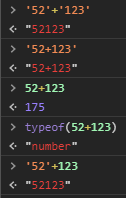

    

  - 덧셈을 제외한 사칙연산은 **숫자**를 우선시 한다

    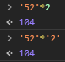

- 명시적 형변환(강제적 형변환)

  - 다른 데이터 타입을 숫자형으로 변환 ==> Number()함수 사용
  - 다른 데이터 타입을 문자열로 변환 ==> String()함수 사용
  - 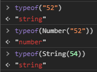
  - NaN : Not a Number
    - 자료형은 숫자이나 js로 나타낼 수 없는 숫자를 의미
    - 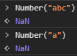

- 명시적 형변환, 묵시적 형변환

  - `0`, `NaN`, `''`, `null`, `undefined` ==> false return

  - 나머지 ==> true return

    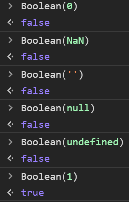

    

  - `0`, `NaN`, `''`, `null`, `undefined` 에 대한 묵시적 형 변환의 문제점

    ```javascript
    <script>
    	console.log('' == false);
    	console.log('' == 0);
    	console.log(0 == false);
    	console.log('273' == 273);
    </script> 
    ```

    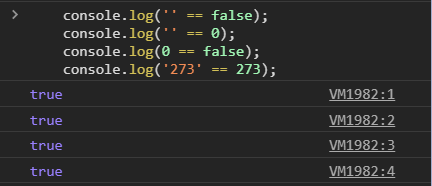

    - 혼란을 야기한다.

  - 일치연산자 : 양변의 자료형과 값의 일치여부를 확인

    - `===` : 양변의 자료형과 값이 모두 일치해야 `true`를 
    - `!==` : 양변의 자료형과 값이 일치하지 않음

    ```javascript
    <script>
    	console.log('' === false);
    	console.log('' === 0);
    	console.log(0 === false);
    	console.log('273' === 273);
    </script> 
    ```

    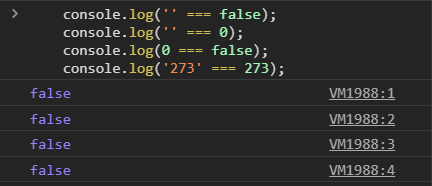
  
  
  
- 템플릿 문자열
  
  - `${ }`
  
    - ```javascript
      const a = "철수";
      const b = "사과";
      console.log('"' + a + '"는 "' + b + '"를 좋아해');
      console.log(`"${a}"는 "${b}"를 좋아해 ... ${a+b}`); 
      ```
  
    - 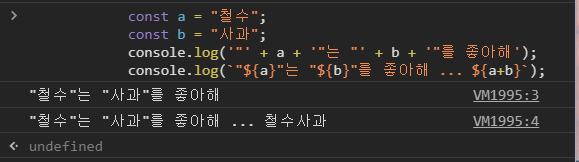

  
  
- 스코프(Scope)

  - ```javascript
        <script>
            {
                var variable = 24;
            }
            {
                console.log(variable);
            }
            console.log(variable);
        </script>
    ```

    - `variable`은 {} 안에서 선언되었는데 밖에서도 읽을 수 있다.
    - 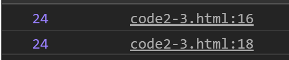

  - let와 var

    ```javascript
        <script>
            {
                let variable = 24;
            }
            {
                console.log(variable);
            }
            console.log(variable);
        </script>
    
    ```

    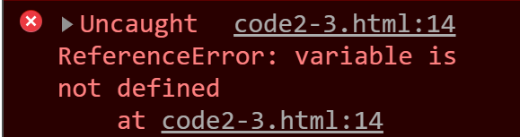

  - `let`

    ```javascript
        <script>
            {
                let variable = 24;
            }
            {
                let variable = 34;
                console.log(variable);
            }
            let variable = 44;
            console.log(variable);
        </script>
    ```

    

  

- 비동기 처리 -- `call back`

  - 익명함수 : 1회성으로 실행될 때 사용하는 함수. 함수의 이름을 따로 주지않음

  - 화살표로 익명함수를 처리. 함수를 정의함과 동시에 실행

  - 최근 많은 함수들이 비동기 처리를 사용한다

  - `setTimeout()` : 비동기 함수

    ```javascript
    <script>
            for(var i=0;i<50; i++){
                setTimeout(()=>{
                    console.log(i);
                },1000*i);
            }
    </script>
    ```

    - 이 함수를 실행하면 `console.log(i)`에서 i가 1씩 증가하며 출력되지 않고 50만 계속 출력된다.

    - 원인은 var를 썼기 때문이다

      

      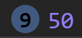

      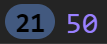

  - `let`을 써보자

    ```javascript
     <script>
            for(let i=0;i<5; i++){
                setTimeout(()=>{
                    console.log(i);
                },1000*i);
            }
        </script>
    ```

    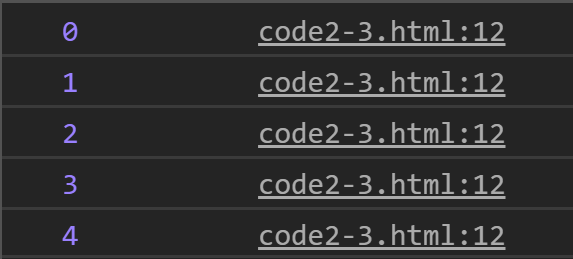

  - ```javascript
        <script>
            for(let i=0;i<5; i++){
                console.log("#1",i);
                setTimeout(()=>{
                    console.log("#2",i);
                },1000*i);
            }
        </script>
    ```

  - #1 0 부터 #1 4 까지는 먼저 나오고 #2 0 부터 #2 1까지는 1초에 1개씩 콘솔창에 출력된다.

  - 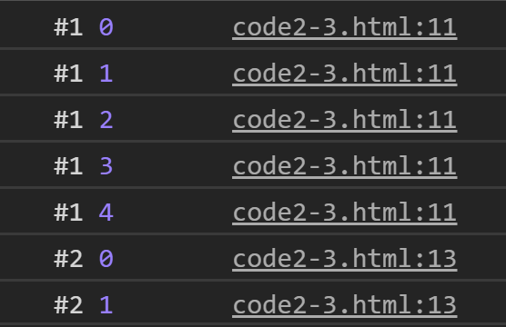

    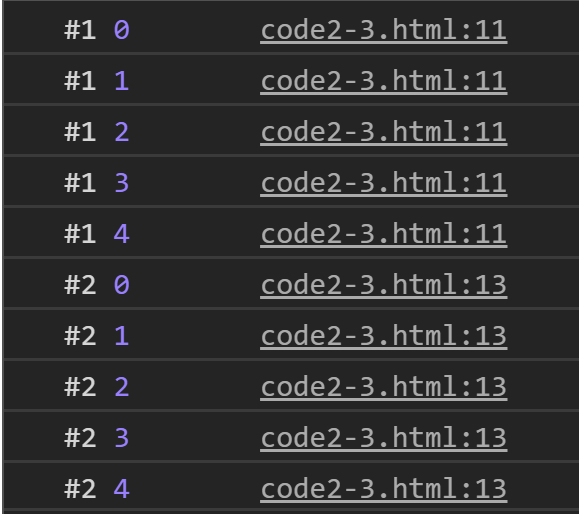

  

- 함수의 호이스팅(Hoisting) : 함수가 정의되기 전에 호출되어도 실행이 가능

  - 함수의 정의를 맨 위로 끌어 올려 놓은것

  - ```javascript
        <script>
            /* 함수의 호이스팅(Hoisting)
                - add 함수가 정의된 부분보다 위에서 호출해도 호출이가능 
            */
            console.log("2+3=", add(2,3));
            function add(x,y){
                return x+y;
            }
        </script>
    
    ```

- `NaN`의 확인

  - 다른 모든 값과 달리 NaN은 같음 연산(==, ===)을 사용해서 판별할 수 없다.

    ```javascript
        <script>
            /*
                사용자로부터 숫자를 입력받아 숫자가 아닌 경우 콘솔에 오류메시지 출력, 숫자인 경우 홀/짝 여부 확인하여 출력
            */
            let num = prompt("숫자를 입력하세요");
            num = Number(num);
            if(isNaN(num)){ 
                console.log("숫자가 아님");
            }
            else{
                if(num%2==0)
                    console.log("짝수입니다");
                else
                    console.log("홀수입니다");
            }
        </script>
    
    ```


- 배열 

  - 하나의 배열에 다양한 자료형의 인자값을 넣을 수 있다.

  ```javascript
  <script>
          /*배열*/
          let array = [273, 'string', true, function() {}, {}, [100,200] ];
          //           숫자, 문자열, boolean, 함수,        객체, 배열
      </script>
  ```

  - 메소드

    - arr.forEach() --> `iterator` 활용

    - arr.push() : 원소 추가

      ```javascript
      /*for each -- iterator 사용*/
      <script>
              // 익명함수 사용
              arr.forEach(function(item){
                  console.log(item);
              });
      		arr.push("안녕하세염");
              // 화살표 함수 사용
              arr.forEach(item=>console.log(item));
      </script>        
      ```

  

- 반복문

  - 방법 : `for loop`, `for in`, `forEach`

    ```javascript
     <script>
            const fruits = [ "사과", "오렌지", "딸기", "바나나" ];
     
            console.log("방법1. for loop");
            for (let i = 0; i < fruits.length; i ++) {
                console.log(fruits[i]);
            }
     
            console.log("방법2. for in");
            for (let i in fruits) {
                console.log(fruits[i]);
            }
     
            console.log("방법3. forEach");
            fruits.forEach(function(fruit) { 
                console.log(fruit);
            });
     
            console.log("방법4. forEach + arrow function");
            fruits.forEach(fruit => console.log(fruit));
            
        </script>
    ```

    

